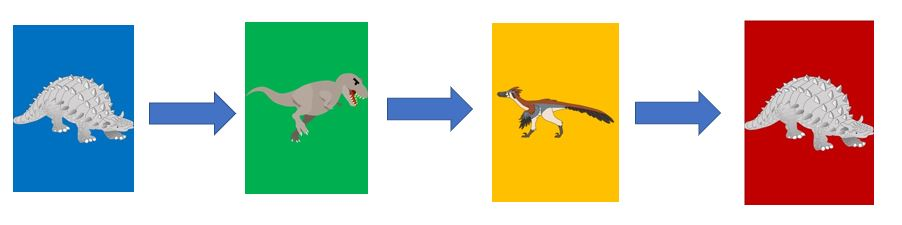

## Comet - Card Game

Comet - Card Game is an original game inspired by an existing card game (where players lose if they draw a specific card and there are save cards that will save the players from the specific card).
The idea is to have both players in the game display their hands on the board and the game mechanics works with both players showing their hands to each other in mind. Each player can interact with each other's cards to make plays in the game to gain more "save" cards that will protect the player from the specific drawn card.

## Rules of the Game:

1. A Deck of 16 cards including 1 Comet card (Total 17 cards) is created at the start of the game. Each player receives a starting hand of 3 cards from the deck and 1 Dino Angel card from outside the deck.

2. If the Comet is drawn by any Player, they lose the game unless they have A Dino Angel Card.

3. When Dino Angel card is clicked when the player has the comet, instead of losing the game, the Dino Angel and Comet disappear from hand and the Comet is reshuffled into the deck.

4. On each player's turn they may take up to one action
   a) Play a pair of Dino cards (one card from each player, in top down order, click White Player's Board first and then Black Player's Board
   i) Megasaurus beats Rex beats Rap-Pack beats Megasaurus (The Player with the winning Dino out of the pair gets the Dino Angel)

ii) If a player accidentally plays a pair where the opponent has the winning Dino, they have spent the turn action to give the opponent a Dino Angel!
b) Play a Dino Angel Card to save themself from The Comet.
c) Play Gift card to steal the opponent's Dino Angel.

5. Players with 6 or more cards in their hand should take an action.

Technologies used
Javascript - for loop, if-else statements, arrays, setTimeout, alert. DOM to insert classnames, img src and do if-else comparisons, removing of innerHTML and classNames through clicking on event.currentTarget and Event Listeners.
CSS
HTML
console.log - troubleshooting
alert statements to show the game rules and if a player won/lost the game.

Game is created with HTML and CSS pages for the basic user interface first, with the respective divs.

javascript codes used for generating the deck, shuffling and dealing the cards and starting hand.

---

### Challenges that required Brainstorming

Brainstorming of key logic of the original card such as setting the logic of when 2 cards are a match e.g. Megasaurus beats Rex, Rex beats Raptor, Raptor beats Megasaurus.

A Dino Angel card is distributed when there is a matching pair when one Dino beats another. While there are no issues with distributing a card to a static card slot is simple, distributing a card to the first empty card slot required brainstorming, and a for loop searching through an empty innerText="" worked to find the first empty card slot and distribute a card there.

Other Key logic is making the 2 matching cards disappear from each players' hand when there is a match and a stored variable with event.currentTarget to used to store the div of the cards clicked and then empty the innerText and classNames of the divs Also, searching through the player's boards for The Comet card when the next turn draw button is clicked, and for the Dino Angel to only be clickable when there is The Comet found in the player's hand.

**Variable to store the 2 cards clicked from White Player's hand and Black Player's hand and then a function to remove the class name and img src of the cards in hand.**

let selectedWhiteRemoval = "";
let selectedBlackRemoval = "";

selectedWhiteRemoval = event.currentTarget;

function removeClassAndImage() {
selectedWhiteRemoval.innerHTML = "";
selectedBlackRemoval.innerHTML = "";
selectedWhiteRemoval.removeAttribute("class");
selectedBlackRemoval.removeAttribute("class");
}

**Searches the white player's hand or black player's hand for "The Comet" depending on which card slot (div) is clicked, and the Dino Angel is only clickable when the Comet is found.**

carddiv.addEventListener("click", function (e) {
console.log("click on angel method: show children array");
console.log(carddiv.parentElement.children);
for (let c = 0; c < 7; c++) {
if (carddiv.parentElement.children[c].classList.contains("The_Comet")) {

        if (e.currentTarget.className == "Dino_Angel") {
          e.currentTarget.removeAttribute("class");
          e.currentTarget.innerHTML = "";
          carddiv.parentElement.children[c].innerHTML = "";
          carddiv.parentElement.children[c].removeAttribute("class");
          deck.deck.push("The_Comet");
          deck.shuffle();
          messageBox.innerHTML = ""; // Clears Call The Comet
          document.getElementById("messageBox").removeAttribute("class");
        }
      }
    }

});

When the Comet is found to be in a player's hand when they draw for their turn, a function alerts the player that they have drawn it, and also adds a class name to the html. Clicking the Dino Angel will remove this class name, if it is not removed within a specific time, a setTimeout function will trigger a function that checks for this class name after that specific time, and if the class name is there, the player that drew for their turn loses.

---

### Current unsolved challenges

Currently in the game, when The Comet is drawn depending, on whether the White Player's Turn Button is clicked or the Black Player's Turn Button is clicked
The Comet will add:

messageBox.className = "White_Player_Loses_in_5secs";
or
messageBox.className = "Black_Player_Loses_in_5secs";

to as a class, and a setTimeout function under the respective's players' turn buttons will search for the respective players' class tag above after a specific time to determine if the player has lost (if within 5 seconds of drawing The Comet, the player who drew it did not click on a Dino Angel to clear/remove the class name, a pop up will appear to let the player know they have lost.)

However, an issue found is that if a player draws The Comet and clears the "game lost class name" with the Dino Angel under 5 seconds, the timer is still running, and if the next player clicked on their turn button and then draws "The Comet", the "Game lost class name" is reapplied while the 5 seconds of the previous play is still counting down, and the next player gets the game lost message pop up almost immediately after drawing it without a change to click on the Dino Angel.

This would make sense if the "game lost class name" for both players are the same, however the "game lost class name" for both players are specific to White Player, and Black Player, and the check for the game lost message also checks for that specific message. Currently this issue requires brainstorming and fixing.
